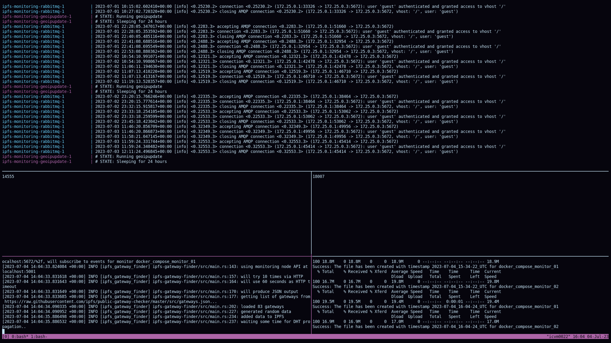

# Part 3 - Monitoring Data Requests with BitSwap

This setup currently works by using [this branch](https://github.com/mrd0ll4r/ipfs-tools/tree/bitswap-file-logging) together with [this fork](https://github.com/S-u-m-u-n/ipfs-metric-exporter).

## Setup

It is absolutely necessary to have a dedicated machine for the BitSwap monitoring setup. Using a dedis-* VM will not be suitable.
We recommend a setup similar to the one below with `tmux`:

<!--  -->


- Top pane:
    - `docker compose up` to run the entire bitswap monitoring setup.

- Two middle panes:
    - `docker exec -it ipfs-monitoring-daemon01-1 /bin/sh`.
        - And running `watch -tn 30 'ipfs swarm peers | wc -l'` inside of the docker container to continously display the number of peers connected to monitor 1.
    - `docker exec -it ipfs-monitoring-daemon02-1 /bin/sh`.
        - And running `watch -tn 30 'ipfs swarm peers | wc -l'` inside of the docker container to continously display the number of peers connected to monitor 2.

    Note that it will take some time (several days) until a decently large number of connected peers is reached.

- Two bottom panes:
    - [find_gateways.sh](find_gateways.sh): Script that uses the ipfs-gateway-finder binary to identify gateway peers.
    - [save_connected_peers.sh](save_connected_peers.sh): Script that saves the connected peers for both monitors.

Three especially useful `tmux` shortcuts:
- `Ctrl+b` + `n` to cycle through the panes.
- `Ctrl+b` + `z` to toggle fullscreen on the focused pane.
- `Ctrl+b` + `[` to activate scroll mode in the focused pane. Can be exited again with `Ctrl+c`.

## Data Analysis

Use the following perl magic to extract all gateway peers from the gateways folder and save them to a file:
`perl -nle 'print $& while m/(?<="peer":")[^"]*(?=")/g' /path/to/gateways_folder/* | sort | uniq > gateway_peers.txt`
The gateway peers that were found during our run are available in [gateway_peers.txt](gateway_peers.txt).

- [plot_peers_per_monitor.py](plot_peers_per_monitor.py): Plots the unique peers common in both monitors, or only present in one of them.
<!--  -->


- [plot_requests_over_time.py](plot_requests_over_time.py): Plots the number of requests received per minute, and compares gateway peers with normal peers.


<!--  -->

- [remove_connection_events.py](remove_connection_events.py): Script that removes connection events from the traces and only keeps BitSwap messages. Will probably not be necessary in the near future, as connection events should be integrated into the unification tool.

- Use the `unify-bitswap-traces` tool from [our branch that works with the new BitSwap message format](https://github.com/S-u-m-u-n/ipfs-tools/tree/new-bitswap-format).

- [plot_URP_RRP.py](plot_URP_RRP.py): Script that generates the RRP_URP plot.

<!--  -->


- [plot_intersection_of_union_peer_id.py](plot_intersection_of_union_peer_id.py): Plots the IoU (Intersection over Union) of the connected peers of the two monitors. We ended up using the [plot_peers_per_monitor.py](plot_peers_per_monitor.py) script instead, but this one is a bit more formal. Another idea is to compute the IoU of the received BitSwap messages, which may or may not be similar to this one (depending on the peers).


## Good To Know
For our setup, we received access to a machine called `icvm0022.xaas.epfl.ch` with ports 4001 and 4002 forwarded (although only TCP traffic was allowed).
It might also be interesting to repeat this experiment and use UDP.

To increase the number of simultaneously possible TCP connections, we increased the `ulimit` systemwide:

1. `sudo vim /etc/security/limits.conf`
2. At the end of the file, add these two lines:
```
* soft nofile 32768
* hard nofile 32768
```
3. Log out and back into the SSH session
